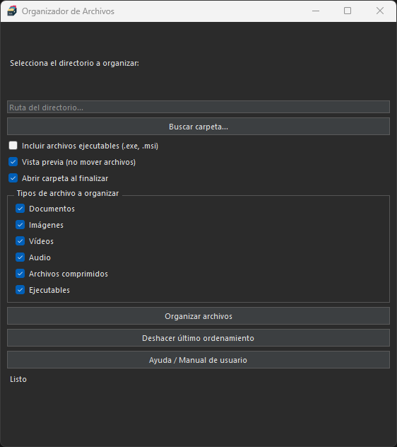

# 📁 File Organizer with PyQt

A simple and efficient desktop application to organize files by type or date, with a user-friendly interface built using PyQt. Includes features like preview mode, undo last action, dark/light theme, and automatic folder opening after sorting.

## ✨ Features

- Organize files by **type** and/or **creation date**
- **Preview** the files before applying changes
- **Undo** the last organization with one click
- **Open the output folder** automatically after organizing
- Support for **dark and light themes**
- **Tooltips** and keyboard shortcuts for better UX
- User manual accessible from the interface
- Warning if more than 100 files are about to be moved

## 🖼️ Screenshots



## 🛠️ Requirements

Install the required libraries with:

```bash
pip install PyQt5
```

You may also use requirements.txt:

```bash
pip install -r requirements.txt
```

## 🚀 How to Run

Run the application with:

```bash
python file_organizer_gui.py
```

## 📂 Project Structure

```
file_organizer_pyqt/
├── core_logic.py # Core file organization logic
├── file_organizer_gui.py
├── README.md
├── requirements.txt
└── assets/
└── screenshots/
```

## 👤 Author

José Manuel Campuzano https://github.com/J1Ejota/
